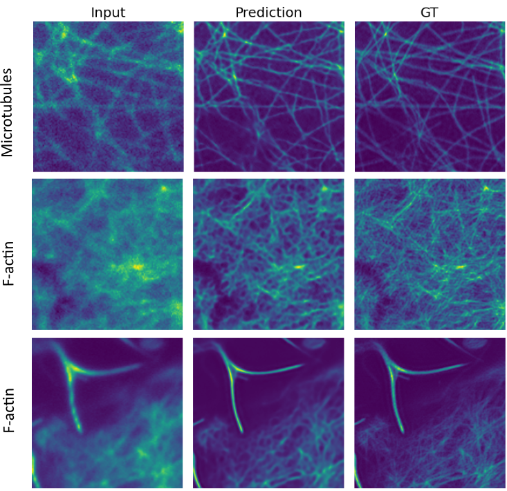

# Projection Upsampling Network (PU-Net): A Deep Learning Approach for SIM Image Reconstruction

## Introduction

The Projection Upsampling Network (PU-Net) is a deep learning-based architecture inspired by the 3D U-Net framework, designed to reconstruct structured illumination microscopy (SIM) images from noisy, low signal-to-noise ratio (SNR) input data. In SIM, raw data typically comprise multiple images captured under varying illumination patterns. For instance, a two-beam SIM system may produce nine images (three angles × three phases), while a three-beam system can generate fifteen images (five angles × three phases).​

In our approach, these multi-channel SIM inputs are treated as a volumetric stack along the z-axis, effectively capturing the spatial and temporal variations inherent in the data. This representation enables PU-Net to learn the intricate spatiotemporal features necessary for accurate SIM reconstruction. By leveraging this strategy, PUNet effectively reconstructs high-fidelity SIM images from noisy, low-SNR datasets, offering a robust solution for enhancing image quality in challenging imaging conditions.​

## Example: Reconstructed SIM Image

Below is an example of a reconstructed SIM image using PU-Net:

    

<!-- [View PDF](images/PU-Net_github_example.pdf) -->

<!-- This [caped] package was generated with [Cookiecutter] using [@caped]'s [cookiecutter-template] template. -->

## Content
- Dataset Generation
- trainng example
- prediciton example
- ImageJ Scripts

## Installation

You can install `projection_upsampling_network` via [pip]:

    pip install projection_upsampling_network

To install latest development version :

    pip install git+https://github.com/ArghaSarker/projection_upsampling_network.git

## Requirement
Python 3.7 and above.

## License

Distributed under the terms of the [MIT] license,
"projection_upsampling_network" is free and open source software

## Issues

If you encounter any problems, please [file an issue] along with a detailed description.

## Acknowledgement

A huge thanks to [Dr. rer. nat. Varun Kapoor](https://github.com/kapoorlab) for his unwavering support and expert guidance that has been pivotal in shaping this project.

## 📚 References
1. Weigert et al. (2018)
Weigert, M., Schmidt, U., Boothe, T., Müller, A., Dibrov, A., Jain, A., Wilhelm, B., Schmidt, D., Broaddus, C., Culley, S., Rocha-Martins, M., Segovia-Miranda, F., Norden, C., Henriques, R., Zerial, M., Solimena, M., Rink, J., Tomancak, P., Royer, L., Jug, F., & Myers, E. W. (2018). Content-aware image restoration: pushing the limits of fluorescence microscopy. Nature Methods, 15(12), 1090–1097. https://doi.org/10.1038/s41592-018-0216-7

2. Qiao & Li (2022)
Qiao, C., & Li, D. (2022). BioSR: a biological image dataset for super-resolution microscopy. figshare. https://doi.org/10.6084/m9.figshare.13264793.v8

3. Marcel Müller, Viola Mönkemöller, Simon Hennig, Wolfgang Hübner, Thomas Huser (2016).
"Open-source image reconstruction of super-resolution structured illumination microscopy data in ImageJ",
Nature Communications, doi: 10.1038/ncomms10980

[pip]: https://pypi.org/project/pip/
[caped]: https://github.com/Kapoorlabs-CAPED
[Cookiecutter]: https://github.com/audreyr/cookiecutter
[@caped]: https://github.com/Kapoorlabs-CAPED
[MIT]: http://opensource.org/licenses/MIT
[BSD-3]: http://opensource.org/licenses/BSD-3-Clause
[GNU GPL v3.0]: http://www.gnu.org/licenses/gpl-3.0.txt
[GNU LGPL v3.0]: http://www.gnu.org/licenses/lgpl-3.0.txt
[Apache Software License 2.0]: http://www.apache.org/licenses/LICENSE-2.0
[Mozilla Public License 2.0]: https://www.mozilla.org/media/MPL/2.0/index.txt
[cookiecutter-template]: https://github.com/Kapoorlabs-CAPED/cookiecutter-template

[file an issue]: https://github.com/ArghaSarker/projection_upsampling_network/issues

[caped]: https://github.com/Kapoorlabs-CAPED/
[tox]: https://tox.readthedocs.io/en/latest/
[pip]: https://pypi.org/project/pip/
[PyPI]: https://pypi.org/
